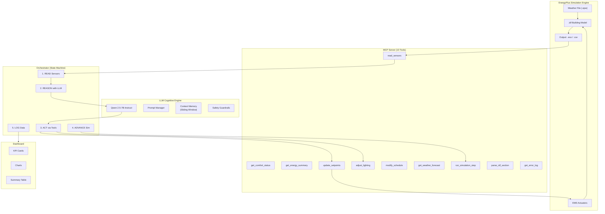
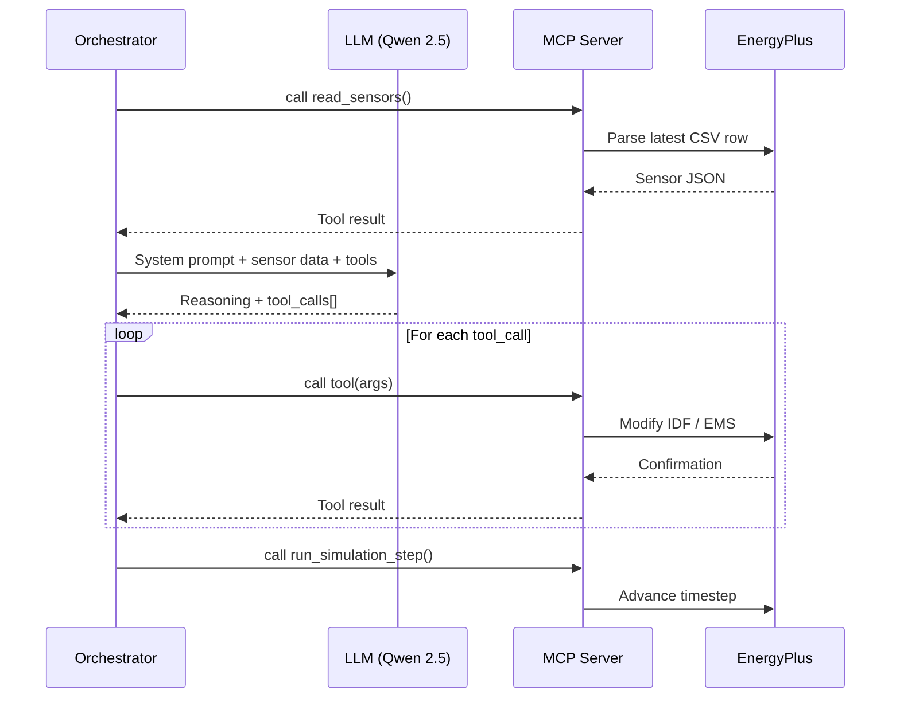

# System Architecture — Eco-Loop Building Agents

## 1. Overview

Eco-Loop is a closed-loop AI system that autonomously optimizes building energy consumption using EnergyPlus as the physics engine and an open-source LLM as the cognitive engine. The system communicates through the Model Context Protocol (MCP), exposing EnergyPlus interactions as structured tools the LLM can invoke.

### Key Innovation
Traditional BMS uses rigid schedules. Eco-Loop uses an LLM that **reasons about** building physics, weather, occupancy, and grid conditions to make dynamic, context-aware control decisions — with self-correction when things go wrong.

---

## 2. System Architecture Diagram

---

## 3. Component Deep-Dive

### 3.1 EnergyPlus Simulation Engine
- **Model**: DOE Reference Small/Medium Office
- **Timestep**: 15-minute intervals (4 per hour)
- **Output variables**: Zone temperatures, humidity, PMV, HVAC energy, lighting energy
- **Control interface**: EMS actuators for runtime setpoint overrides

### 3.2 MCP Server & Tool Definitions
- **Transport**: stdio (primary) / SSE (for dashboard integration)
- **10 tools** covering observation, control, and diagnostics
- **Error handling**: Every tool returns structured JSON with success/error status

### 3.3 LLM Cognitive Engine
- **Model**: Qwen 2.5-7B-Instruct (best OSS tool-calling accuracy)
- **Runtime**: Ollama (local inference)
- **Temperature**: 0.2 (deterministic for control decisions)
- **Context window**: Managed by sliding-window memory

### 3.4 Closed-Loop Orchestrator
- **State machine**: INIT → READING → REASONING → ACTING → ADVANCING → LOGGING
- **Self-correction**: Failed tool calls are fed back to the LLM for recovery
- **Safe mode**: After 5 consecutive failures, falls back to default setpoints

---

## 4. Tool-Calling Architecture

### MCP Protocol Flow

### Error Handling & Self-Correction
1. Tool call fails → structured error returned
2. Error fed back to LLM with recovery prompt
3. LLM suggests corrective action (up to 3 retries)
4. If all retries fail → safe defaults applied

---

## 5. Prompt Engineering Strategies

### System Prompt Design
- **Role definition**: Clear identity as building energy optimizer
- **Prioritized objectives**: Safety > Comfort > Energy > Cost > Carbon
- **Tool documentation**: Inline descriptions with parameter constraints
- **Strategy hints**: Pre-cooling, night setback, deadband widening
- **Output schema**: Enforced JSON structure for reasoning + tool calls

### Per-Timestep Message
- Structured markdown with all sensor readings
- Previous action outcomes for continuity
- Grid and weather context for forward planning

---

## 6. Prompt Latency Management

| Strategy | Implementation |
|----------|---------------|
| **Batched payloads** | All sensor data in one JSON blob per timestep |
| **Concise output schema** | Structured JSON reduces token count |
| **Low temperature** | 0.2 — fewer sampling iterations |
| **Model quantization** | Ollama uses GGUF Q4 by default (~4GB VRAM) |
| **Token budget** | max_tokens=2048 prevents runaway generation |
| **Timeout** | 30s hard limit per LLM call |

---

## 7. Handling Lengthy Simulation Logs

| Challenge | Solution |
|-----------|----------|
| `.eso` files can be 100MB+ | Parse only latest timestep via `parser.py` |
| Error logs grow unbounded | Extract last 50 lines + count warnings/errors |
| Context window overflow | Sliding window: last 20 timesteps in detail, older data summarized |
| Large IDF files | Parse only requested sections via `parse_idf_section` tool |

---

## 8. Results & Analysis

*[To be populated after simulation runs]*

| Metric | Baseline | AI-Optimized | Δ |
|--------|----------|-------------|---|
| Total Energy (kWh) | | | |
| Peak Demand (kW) | | | |
| Comfort Compliance (%) | | | |
| Cost (USD) | | | |
| CO₂ (kg) | | | |
