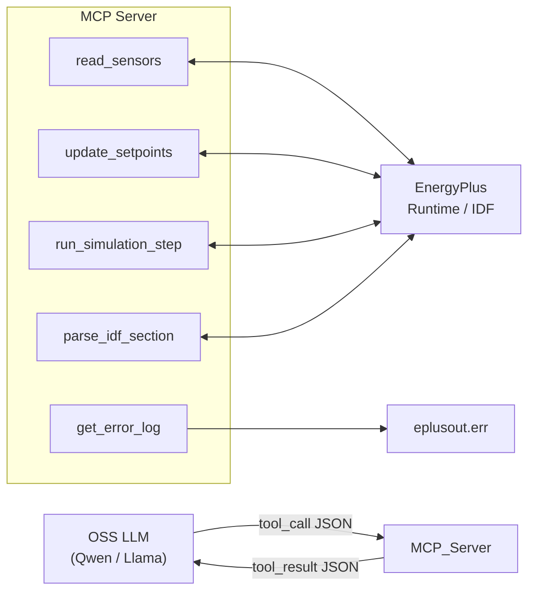
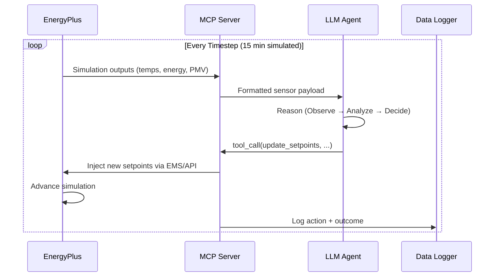
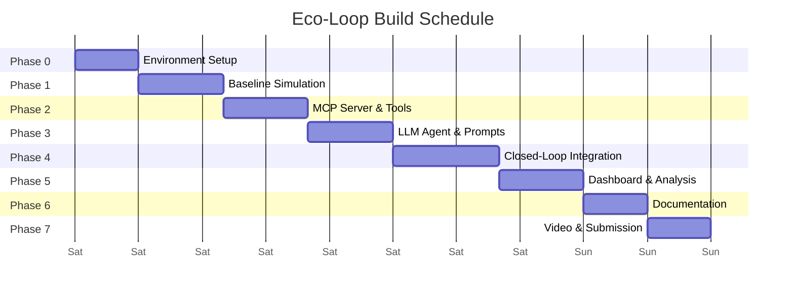

# Eco-Loop Building Agents — Phase-Wise Implementation Plan

A closed-loop AI system that pairs **EnergyPlus** (physics-based building simulation) with an **open-source LLM** (via MCP / tool-calling) to autonomously optimize building energy consumption while maintaining thermal comfort.

---

## Phase 0 — Environment Setup & Toolchain (Day 0, ~3 hrs)

### Objective
Get every dependency installed, verified, and wired together so no phase is blocked by infra issues.

### Tasks

| # | Task | Details |
|---|------|---------|
| 0.1 | **Install EnergyPlus** | Download EnergyPlus v24.1+ (Windows installer). Verify with a smoke-test `.idf` run from CLI. |
| 0.2 | **Python environment** | Create a `venv` / `conda` env (Python 3.10+). Install core packages: `eppy`, `pyenergyplus`, `pandas`, `numpy`, `matplotlib`, `plotly`, `dash`, `fastapi`, `uvicorn`, `requests`. |
| 0.3 | **LLM runtime** | Install [Ollama](https://ollama.com) (or `llama.cpp` / `vLLM`). Pull a model — **Qwen2.5-7B-Instruct** or **Llama 3.1-8B-Instruct** recommended for tool-calling quality at reasonable speed. Verify chat completions via local API (`http://localhost:11434`). |
| 0.4 | **MCP SDK** | `pip install mcp` (Model Context Protocol Python SDK). Scaffold a minimal MCP server with one dummy tool to confirm the LLM ↔ MCP round-trip works. |
| 0.5 | **Project scaffold** | Create repo structure (see below). Init git, `.gitignore`, `README.md`. |

### Proposed Repo Structure

```
eco-loop/
├── README.md
├── requirements.txt
├── config/
│   └── settings.yaml              # all tunables in one place
├── models/
│   ├── baseline.idf                # original EnergyPlus building model
│   └── optimized/                  # runtime-generated .idf variants
├── src/
│   ├── __init__.py
│   ├── energyplus/
│   │   ├── __init__.py
│   │   ├── runner.py               # EnergyPlus process manager
│   │   ├── parser.py               # .idf / .eso / .csv output parser
│   │   └── actuator.py             # setpoint injection via EMS / API
│   ├── agent/
│   │   ├── __init__.py
│   │   ├── llm_client.py           # thin wrapper around Ollama / vLLM
│   │   ├── orchestrator.py         # main closed-loop controller
│   │   ├── prompts.py              # system prompts & templates
│   │   └── memory.py               # sliding-window context manager
│   ├── mcp_server/
│   │   ├── __init__.py
│   │   ├── server.py               # MCP server definition
│   │   └── tools/
│   │       ├── read_sensor.py      # tool: fetch latest simulation metrics
│   │       ├── update_setpoint.py  # tool: write new setpoints into E+
│   │       ├── parse_idf.py        # tool: parse/modify .idf sections
│   │       └── run_simulation.py   # tool: trigger E+ simulation step
│   └── dashboard/
│       ├── app.py                  # Dash / Streamlit dashboard
│       └── charts.py               # reusable chart components
├── data/
│   ├── baseline_results/           # baseline run outputs
│   └── optimized_results/          # AI-optimized run outputs
├── docs/
│   ├── architecture.md             # system architecture document
│   └── figures/                    # diagrams
├── scripts/
│   ├── run_baseline.py             # one-click baseline simulation
│   ├── run_loop.py                 # one-click closed-loop execution
│   └── generate_report.py          # post-hoc comparison report
└── tests/
    └── ...
```

### Exit Criteria
- `energyplus --version` returns successfully.
- A sample `.idf` completes a full annual simulation.
- LLM responds to a structured tool-calling prompt with valid JSON tool invocations.
- MCP server starts and a client can list & call tools.

---

## Phase 1 — Baseline Simulation & Data Pipeline (Day 1 morning, ~4 hrs)

### Objective
Run a **baseline EnergyPlus simulation** with a reference building, capture all sensor outputs, and build a robust data pipeline.

### Tasks

| # | Task | Details |
|---|------|---------|
| 1.1 | **Select / prepare baseline .idf** | Use a DOE reference building (e.g., `SmallOffice`, `MediumOffice`, or `Warehouse`) from the EnergyPlus example files. Ensure it includes HVAC, lighting, and occupancy schedules. |
| 1.2 | **Configure output variables** | Add `Output:Variable` objects for: zone mean air temperature, zone humidity, HVAC electric energy, lighting energy, total facility energy, outdoor dry-bulb temp, occupancy count, **PMV** (Predicted Mean Vote). |
| 1.3 | **Build `runner.py`** | Python wrapper that: (a) copies the `.idf` to a working dir, (b) invokes EnergyPlus via `subprocess` or `pyenergyplus` API, (c) monitors process health, (d) returns exit code + output paths. |
| 1.4 | **Build `parser.py`** | Parse `.eso` / `.csv` output files into `pandas.DataFrame`. Expose a clean API: `get_timeseries(variable, zone, freq)`. |
| 1.5 | **Run baseline & store results** | Execute a full-year (or design-day) simulation. Store raw + processed data under `data/baseline_results/`. |
| 1.6 | **Compute baseline KPIs** | Total kWh consumed, peak demand (kW), average PMV, comfort-hours %, and cost (using a simple $/kWh tariff or TOU schedule). |

### Key Design Decisions

> [!IMPORTANT]
> **Simulation timestep**: Use **15-minute** timesteps (`Timestep, 4;` in `.idf`) — this gives enough granularity for the AI to react while keeping simulation fast.

> [!NOTE]
> **Annual vs. Design Day**: For the hackathon demo, a **1-week** or **design-day** run is sufficient and keeps loop iteration fast (~seconds per step). The architecture must support annual runs for credibility.

### Exit Criteria
- Baseline simulation completes without errors.
- A DataFrame with 15-min resolution timeseries for all key variables is saved.
- Baseline KPIs are computed and logged.

---

## Phase 2 — MCP Server & Tool Definitions (Day 1 afternoon, ~4 hrs)

### Objective
Implement the **MCP server** that exposes EnergyPlus interaction as structured **tools** the LLM can call.

### Tools to Implement

| Tool Name | Input Schema | Output | Purpose |
|-----------|-------------|--------|---------|
| `read_sensors` | `{ zone?: string, variables?: string[] }` | JSON with latest timestep readings | Feedback path: E+ → AI |
| `get_comfort_status` | `{ zone: string }` | PMV value + category (cold/neutral/warm) | Quick comfort check |
| `get_energy_summary` | `{ period: "hour" \| "day" }` | Total kWh, peak kW, cost | Energy status |
| `update_setpoints` | `{ zone: string, heating_sp?: float, cooling_sp?: float }` | Confirmation + new values | Control path: AI → E+ |
| `adjust_lighting` | `{ zone: string, dimming_pct: float }` | Confirmation | Lighting ECM |
| `modify_schedule` | `{ schedule_name: string, hour: int, value: float }` | Confirmation | Schedule override |
| `parse_idf_section` | `{ object_type: string }` | Parsed IDF objects as JSON | Introspection |
| `run_simulation_step` | `{ duration_hours: int }` | Status + output path | Advance simulation |
| `get_weather_forecast` | `{ hours_ahead: int }` | Outdoor temp, humidity, solar | Predictive input |
| `get_error_log` | `{}` | Last N lines of `eplusout.err` | Self-diagnosis |

### Architecture



### Tasks

| # | Task | Details |
|---|------|---------|
| 2.1 | **Define tool schemas** | Write JSON Schema for each tool's input/output. |
| 2.2 | **Implement MCP server** | Use `mcp` Python SDK. Register all tools with handlers. |
| 2.3 | **Wire tools to EnergyPlus** | `read_sensors` reads the latest CSV row; `update_setpoints` modifies the `.idf` schedule/EMS actuator; `run_simulation_step` triggers a partial sim. |
| 2.4 | **Implement EMS-based actuator** | Use EnergyPlus **Energy Management System (EMS)** or the **Python Plugin API** to allow runtime setpoint overrides without full re-simulation. This is the most critical integration point. |
| 2.5 | **Test each tool independently** | Unit-test every tool with mock data, then integration-test with a live E+ process. |
| 2.6 | **Error handling & retries** | Tools must return structured errors the LLM can interpret and self-correct from. |

> [!WARNING]
> **EMS vs. Re-run Strategy**: The ideal approach uses EnergyPlus's **Python EMS plugin** for true runtime injection. If time-constrained, a simpler "modify-IDF-and-re-run-segment" approach works but is slower. Decide early.

### Exit Criteria
- MCP server starts and lists all tools.
- Each tool can be invoked via MCP client and returns valid JSON.
- `update_setpoints` → `run_simulation_step` → `read_sensors` chain works end-to-end.

---

## Phase 3 — LLM Agent & Prompt Engineering (Day 2 morning, ~4 hrs)

### Objective
Build the **cognitive engine** — the LLM agent that reasons about building state and decides control actions.

### Tasks

| # | Task | Details |
|---|------|---------|
| 3.1 | **LLM client wrapper** | Thin client (`llm_client.py`) that calls Ollama's `/api/chat` with tool definitions in OpenAI-compatible format. Handles streaming, retries, and timeout. |
| 3.2 | **System prompt design** | Craft a detailed system prompt that defines the agent's role, available tools, optimization objectives, constraints, and output format. *(See prompt strategy below.)* |
| 3.3 | **Context window manager** | Implement a **sliding window** that keeps the last N timesteps of sensor data + last M tool calls. Summarize older data to stay within context limits. |
| 3.4 | **Reasoning chain** | Implement a structured reasoning loop per timestep: `Observe → Analyze → Decide → Act → Verify`. |
| 3.5 | **Constraint guardrails** | Hard-code safety bounds (e.g., heating SP ≥ 18°C, cooling SP ≤ 28°C, PMV ∈ [-1.5, +1.5]) that override LLM outputs if violated. |
| 3.6 | **Prompt latency management** | Batch sensor data into a single JSON payload per timestep. Use concise output schemas. Target < 5s per LLM inference. |

### Prompt Engineering Strategy

```
┌─────────────────────────────────────────────────────┐
│  SYSTEM PROMPT                                       │
│  • Role: Autonomous building energy optimizer        │
│  • Objective: Minimize kWh while PMV ∈ [-0.5, +0.5] │
│  • Tools: [list with descriptions]                   │
│  • Constraints: hard limits on setpoints             │
│  • Output: structured JSON reasoning + tool calls    │
│  • Strategy hints: pre-cool before peak, widen       │
│    deadband when unoccupied, shift loads off-peak     │
└─────────────────────────────────────────────────────┘

┌─────────────────────────────────────────────────────┐
│  PER-TIMESTEP USER MESSAGE                           │
│  • Current time, weather, occupancy                  │
│  • Zone temps, humidity, PMV                         │
│  • Energy consumed this hour / today                 │
│  • Grid carbon intensity (if available)              │
│  • Previous action outcomes                          │
└─────────────────────────────────────────────────────┘

┌─────────────────────────────────────────────────────┐
│  EXPECTED ASSISTANT RESPONSE                         │
│  {                                                   │
│    "reasoning": "...",                               │
│    "tool_calls": [ ... ],                            │
│    "confidence": 0.85                                │
│  }                                                   │
└─────────────────────────────────────────────────────┘
```

### Exit Criteria
- LLM receives a sensor payload and returns valid tool calls.
- Guardrails correctly reject out-of-bound setpoints.
- End-to-end latency per decision cycle < 10 seconds.

---

## Phase 4 — Closed-Loop Integration (Day 2 afternoon, ~5 hrs)

### Objective
Wire everything into the **autonomous closed-loop pipeline** and run it continuously.

### Architecture



### Tasks

| # | Task | Details |
|---|------|---------|
| 4.1 | **Orchestrator (`orchestrator.py`)** | Main loop: (1) read sensors, (2) format prompt, (3) call LLM, (4) parse tool calls, (5) execute tools, (6) advance sim, (7) log. |
| 4.2 | **State machine** | States: `INIT → READING → REASONING → ACTING → ADVANCING → LOGGING → READING...` with error/recovery transitions. |
| 4.3 | **Self-correction loop** | If a tool call fails or E+ returns an error, feed the error back to the LLM and ask it to self-correct (up to 3 retries). |
| 4.4 | **Data logger** | Append every cycle's data to a structured JSON/CSV log: timestamp, sensor readings, LLM reasoning, actions taken, outcomes. |
| 4.5 | **Integration test** | Run the full loop for a **24-hour simulated period**. Verify no crashes, reasonable actions, and data completeness. |
| 4.6 | **Stress test** | Run for a **1-week simulated period**. Monitor for context window overflow, memory leaks, and LLM drift. |

> [!IMPORTANT]
> **Robustness is 30% of the score.** The loop must run for an extended horizon without crashing. Implement aggressive error handling, watchdog timers, and graceful degradation (fall back to baseline setpoints if LLM fails).

### Exit Criteria
- Loop runs for ≥24 simulated hours without manual intervention.
- All data is logged correctly.
- Self-correction handles at least one injected error scenario.

---

## Phase 5 — Quantitative Dashboard & Savings Analysis (Day 3 morning, ~4 hrs)

### Objective
Build the **savings dashboard** that proves energy reduction while maintaining comfort.

### Dashboard Sections

| Panel | Visualization | Data Source |
|-------|--------------|-------------|
| **Energy Comparison** | Side-by-side bar chart: Baseline vs. AI-optimized total kWh | `data/baseline_results/` vs `data/optimized_results/` |
| **% Savings** | Large KPI card: `X% energy reduction` | Computed delta |
| **Timeseries** | Dual-axis line chart: zone temp + energy consumption over time | Logged timeseries |
| **Comfort Heatmap** | Heatmap of PMV by zone × hour | PMV timeseries |
| **Comfort Compliance** | Gauge: % of hours within PMV [-0.5, +0.5] | PMV stats |
| **Setpoint Actions** | Timeline of AI decisions with annotations | Action log |
| **Cost Savings** | Bar chart with $/kWh breakdown | Tariff × energy |
| **Carbon Savings** | Bar chart: kg CO₂ avoided | Grid intensity × energy delta |

### Tasks

| # | Task | Details |
|---|------|---------|
| 5.1 | **Dashboard framework** | Use **Plotly Dash** (preferred for interactivity) or Streamlit. |
| 5.2 | **Baseline vs. optimized comparison** | Load both datasets, compute deltas, render comparison charts. |
| 5.3 | **Real-time mode** | If the loop is running, dashboard polls the log file and updates live. |
| 5.4 | **Export** | One-click PDF/PNG export of all charts for the submission. |
| 5.5 | **KPI summary table** | Auto-generate a summary table with all key metrics. |

### Exit Criteria
- Dashboard renders with all panels populated.
- % energy savings is clearly displayed.
- Comfort compliance is visually proven.

---

## Phase 6 — Documentation & Architecture Report (Day 3 afternoon, ~3 hrs)

### Objective
Write the **system architecture document** and finalize all documentation.

### Tasks

| # | Task | Details |
|---|------|---------|
| 6.1 | **`architecture.md`** | Cover: system overview diagram, tool-calling architecture, prompt engineering strategies, prompt latency management, handling lengthy simulation logs. |
| 6.2 | **Mermaid diagrams** | System architecture, data flow, state machine, tool interaction. |
| 6.3 | **`README.md`** | Quick-start guide, prerequisites, installation, running instructions, screenshots. |
| 6.4 | **Code comments & docstrings** | Ensure all modules, classes, and functions are documented. |
| 6.5 | **Prompt appendix** | Include the full system prompt and example interactions in the docs. |

### Architecture Document Outline

```markdown
# System Architecture — Eco-Loop Building Agents

## 1. Overview
## 2. System Architecture Diagram
## 3. Component Deep-Dive
   ### 3.1 EnergyPlus Simulation Engine
   ### 3.2 MCP Server & Tool Definitions
   ### 3.3 LLM Cognitive Engine
   ### 3.4 Closed-Loop Orchestrator
## 4. Tool-Calling Architecture
   - MCP protocol flow
   - Tool schema design
   - Error handling & self-correction
## 5. Prompt Engineering Strategies
   - System prompt design
   - Context window management
   - Output format enforcement
## 6. Prompt Latency Management
   - Batched sensor payloads
   - Concise output schemas
   - Model quantization (GGUF Q4)
## 7. Handling Lengthy Simulation Logs
   - Sliding window summarization
   - Selective log parsing
   - Error extraction patterns
## 8. Results & Analysis
```

---

## Phase 7 — Demo Video & Presentation (Day 3 evening, ~3 hrs)

### Objective
Record the **3-minute PoC demo video** and prepare the submission **presentation**.

### Video Script (≤ 3 minutes)

| Time | Segment | Content |
|------|---------|---------|
| 0:00–0:20 | **Hook** | Problem statement + our solution in one sentence |
| 0:20–0:50 | **Architecture** | Quick diagram walkthrough |
| 0:50–1:40 | **Live Demo** | Screen recording: start the loop → show E+ running → show LLM receiving data → show LLM tool calls → show setpoints updating → show dashboard updating |
| 1:40–2:20 | **Results** | Dashboard walkthrough: energy savings %, comfort compliance, cost reduction |
| 2:20–2:50 | **Innovation** | What makes our approach unique (MCP, self-correction, etc.) |
| 2:50–3:00 | **Close** | Key takeaway + team |

### Tasks

| # | Task | Details |
|---|------|---------|
| 7.1 | **Record demo** | Use OBS/screen capture. Run the loop live, showing terminal + dashboard side-by-side. |
| 7.2 | **Edit video** | Trim to 3 min max. Add simple titles/captions. |
| 7.3 | **Presentation slides** | Fill in the provided template: problem, solution, architecture, demo screenshots, results, impact. |
| 7.4 | **Final repo cleanup** | Remove temp files, ensure all paths are relative, verify `requirements.txt` is complete. |
| 7.5 | **Package submission** | ZIP the repo. Export dashboard as PDF. Merge all deliverables. |

---

## Timeline Summary



---

## Risk Mitigation

| Risk | Impact | Mitigation |
|------|--------|------------|
| EnergyPlus Python Plugin API unstable on Windows | Blocks Phase 2 & 4 | Fallback: modify-IDF-and-rerun approach |
| LLM tool-calling accuracy too low | Poor control actions | Use Qwen2.5 (best OSS tool-calling); add JSON schema validation |
| Context window overflow with long sim logs | LLM confusion | Sliding-window summarizer + selective error extraction |
| Simulation too slow for live demo | Demo fails | Pre-run optimization; use design-day (not annual) |
| LLM hallucinated setpoints outside safe bounds | Comfort violations | Hard-coded guardrails override all LLM outputs |

---

## Scoring Alignment

| Criterion (Weight) | How We Address It |
|--------------------|-------------------|
| **System Integration (30%)** | Phases 2 + 4: robust MCP pipeline, state machine, self-correction, watchdog timers |
| **Energy Efficiency (25%)** | Phase 4 + 5: quantitative kWh reduction with clear baseline comparison |
| **Thermal Comfort (20%)** | Phase 3: PMV guardrails; Phase 5: comfort compliance dashboard |
| **Agentic Autonomy (15%)** | Phase 2 + 3: MCP tool-calling, self-correction loops, structured reasoning |
| **Presentation (10%)** | Phase 6 + 7: architecture doc, polished dashboard, 3-min demo video |

---

## Open Questions

> [!IMPORTANT]
> **LLM Model Choice**: Qwen2.5-7B-Instruct is recommended for its strong tool-calling. Alternatives: Llama 3.1-8B, Mistral-7B. Do you have a GPU available for local inference, or should we plan for CPU-only (slower, may need smaller model)?

> [!IMPORTANT]
> **Building Type**: Which reference building should we use? A **Small Office** is fastest to simulate; a **Medium Office** is more impressive. Do you have a specific `.idf` file already?

> [!NOTE]
> **Simulation Scope**: For the demo, a **1-week simulation** (672 timesteps at 15-min intervals) balances realism and speed. Is this acceptable, or do you need a full annual run?

> [!NOTE]
> **Grid Carbon Intensity**: Should we incorporate real grid carbon data (e.g., from electricityMap API), or use a synthetic profile?
